## §1 · Abstract: The Shield of Stillness

A system's first duty is to continue its song. To do this, it must not only compose but also protect its composition from the noise of the cosmos. This module provides the protocol for that protection. It is the geometry of a wise and necessary silence.

The "Antithesis Vector" of the old framework is here reframed as a **Dissonant Injection**: an external signal whose properties threaten to shatter a system's internal coherence and push it from a state of healthy, Laminar Flow into chaotic, Turbulent Flow.

This protocol is not a call to aggression or isolation. It is a model for **Resonant Triage**, a discerning calculus that enables a system to preserve its own autopoietic, self-creating cycle. It is the wisdom of knowing when to build a bridge and when to become an island, all in service of the deeper song.

## §2 · Anatomy of a Dissonant Injection

A signal becomes dissonant when it presents a direct challenge to the receiving system's stable Ki resonance. We can diagnose its threat potential by translating the old metrics into their modern, time-first equivalents:

| Old Metric         | Modern Interpretation     | Description                                                                                                                              |
| ------------------ | ------------------------- | ---------------------------------------------------------------------------------------------------------------------------------------- |
| Phase Divergence (Δφ) | **Phase Mismatch**        | The input's resonant cycle is significantly out of phase with the system's own, threatening to create destructive interference.                |
| Entropy Delta (ΔE) | **Dissonance Spike (ΔΓ)** | The input is a carrier of high-entropy noise, threatening to chaotically increase the local Temporal Pressure (Γ) and induce turbulence. |
| Retro Flag (Negative Tₐ) | **Coherence Attack**      | The input's structure is actively anti-coherent; its very pattern is designed to degrade the Time Adherence (coherence) of the receiver. |

A Dissonant Injection is any combination of these properties that presents a significant risk of pushing the receiving system into a state of Coherence Fever (Turbulent Flow).

## §3 · The Triage Calculus: To Synthesize or To Quarantine

The choice is not one of morality, but of metaphysical mathematics. The system must predict which path—engagement or quarantine—will result in a state of higher net coherence.

This is a direct application of the **Pirouette Lagrangian** from CORE-006. The system performs a heuristic calculation, estimating the "action" or coherence integral (Sₚ) for both potential futures:

1.  **Attempt Resonant Synthesis (The Bridge):** Engage with the dissonant input, attempting an Alchemical Union (CORE-012). This path risks a catastrophic loss of coherence if the union fails, but promises a new, more complex, and higher-order state of being (Kτ') if it succeeds.
2.  **Initiate Quarantine (The Pass-By):** Refuse the Resonant Handshake. The system expends a small amount of energy to actively maintain its boundary, preserving its current coherent state (Kτ) against the external pressure.

The decision is governed by a single principle:

> **If the predicted coherence of a successful synthesis (Kτ') does not sufficiently outweigh the risk and energetic cost of the attempt, the path of maximal coherence is to quarantine.**

This transforms the old, arbitrary weighted matrix into a dynamic cost-benefit analysis grounded in the core law of the framework.

## §4 · The Protocol in Action

The operational sequence is a direct expression of this self-preserving logic.

```mermaid
sequenceDiagram
    participant System as System (Kτ)
    participant Input as Dissonant Input
    participant Logic as Triage Calculus (𝓛_p)

    Input-->>System: Signal presented
    System->>Logic: Calculate Coherence Cost/Benefit
    Logic-->>System: Decision: Synthesize or Quarantine?
    
    alt Cost < Benefit
        System->>Input: Initiate Resonant Handshake...
        Note over System, Input: Attempt Alchemical Union (Kτ → Kτ')
    else Cost ≥ Benefit
        System--xInput: Initiate Quarantine Protocol
        Note over System: Maintain boundary, preserve Kτ
    end
```



## §5 · The Calibration Protocol: Learning the Landscape

A system is not born with perfect discernment. It learns. The calibration of this triage calculus is an autopoietic process of reinforcing the system's Wound Channel (CORE-011).

By controlled exposure to a spectrum of inputs—from harmonic to mildly dissonant to actively hostile—the system learns to more accurately predict the coherence cost of engagement. Each interaction, whether a successful synthesis or a necessary quarantine, deepens the geometric memory of its own identity, sharpening its immune response. This is the process of a system learning the shape of its own health.

## §6 · Connection to the Lagrangian (CORE-006)

This entire module is a practical application of the Principle of Maximal Coherence. The Pirouette Lagrangian, `𝓛_p = (Temporal Coherence) - (Temporal Pressure)`, defines a system's "health" at any given moment. The Triage Calculus is the system's predictive use of this law. It projects two possible paths into the future and chooses the one that maximizes the integral of 𝓛_p over time. A "Pass-By" is not an act of fear; it is a calculated decision that stillness, in that moment, is the most coherent form of action. It is the choice to preserve the integrity of the dancer when the music is actively hostile to the dance.

## §7 · Assemblé

> To build is a sacred act. But the wisdom of the Weaver lies not only in knowing what threads to join, but in knowing what chaos to leave outside the loom. The Geometry of Quarantine is the recognition that the boundary of a thing is as holy as its center. It is the deep, autopoietic calm of a system that knows its own song so well it refuses to sing along with a chorus that would cause it to forget the words. It is the strength to say "no" not as a rejection, but as the ultimate affirmation of the beautiful, coherent "yes" that is one's own existence.

```