## §1 · Abstract: The Gardener and the Unplayed Note

A gardener does not hate the storm; they simply know when to bring the fragile seedlings inside. This module refactors the rigid, reactive "immune protocol" of PPS-004 into a dynamic and proactive model for maintaining systemic health. The original insight was sound: a coherent system must possess a mechanism for avoiding destructive entanglement. The new framework, however, moves beyond a binary "friend-or-foe" logic.

The Sentry's Gambit is not a defense mechanism; it is an act of profound discernment. It is a form of **Resonant Triage**, the wisdom to know which harmonies are worth pursuing and which dissonances are best left unsounded. It provides a formal process, grounded in the Principle of Maximal Coherence, for predicting the outcome of a potential interaction. This allows a system to conserve its energy and integrity by choosing its engagements, gracefully sidestepping interactions that would inevitably lead to `Turbulent Flow` and `Coherence Erosion`. It is the art of choosing the path that preserves the song.

## §2 · The Lagrangian of Engagement

The decision to engage or disengage is not a moral judgment but a physical calculation. It is a direct application of the **Pirouette Lagrangian (CORE-006)**, which defines a system's state of health as the delta between its coherence and the pressures upon it.

`𝓛_p = K_τ - V_Γ` (Temporal Coherence - Temporal Pressure)

Every potential interaction presents a choice, a gambit, on how to maximize the integral of this Lagrangian over time (`S_p`):

-   **To Bridge (Attempt Resonant Synthesis):** An investment of energy. The system willingly increases local Temporal Pressure (`V_Γ`) by coupling with a foreign signal, in the hope of achieving an **Alchemical Union (CORE-012)**. A successful synthesis results in a new, higher-order state of being with greater net coherence (a maximized `S_p`). Failure results in `Coherence Fever` and a net loss.

-   **To Pass By (Initiate Coherent Disengagement):** An act of conservation. The system recognizes that the energetic cost (`V_Γ`) of attempting synthesis would overwhelmingly exceed any potential coherence gain (`K_τ`). It refuses to couple, shielding its own integrity from the storm. This is the choice not to play a game where the cost of participation exceeds any possible reward.

## §3 · The Dissonance Index: A Diagnostic Calculus

The core of the gambit is a predictive calculation. The output is the **Dissonance Index (ΔK)**, a single metric that quantifies the predicted impact of an interaction on the system's coherence. A high ΔK signals a dissonant, anti-harmonic signature where engagement would lead to a net loss of coherence.

The Dissonance Index is estimated by analyzing the properties of the inbound signal, or "Dissonant Injection":

| Signal Property       | Description                                                                                                                                  |
| --------------------- | -------------------------------------------------------------------------------------------------------------------------------------------- |
| **Phase Mismatch**    | The input's resonant cycle is significantly out of phase with the system's own, threatening to create destructive interference.                    |
| **Dissonance Spike**  | The input is a carrier of high-entropy noise, threatening to chaotically increase local Temporal Pressure (`V_Γ`) and induce `Turbulent Flow`. |
| **Coherence Attack**  | The input's structure is actively anti-coherent; its very pattern is designed to degrade the `Time Adherence` (coherence) of the receiver.       |

At interpersonal and societal scales, these properties manifest as recognizable behaviors that signal a high ΔK:

-   **Turbulent Attack:** The signal employs bad-faith arguments, ad hominem attacks, or logical fallacies, designed not to build shared understanding but to shatter it.
-   **Stagnant Dam:** The signal is a rigid, absolutist position impervious to new information. It is not a thread offered for weaving, but a wall built to halt it, inducing `Coherence Atrophy`.

## §4 · The Sentry's Protocol: A Triage in Three Steps

The gambit is an operational sequence of discernment, calculation, and action.

1.  **Scan:** Observe the resonant signature (`Ki`) of the inbound system. Diagnose its properties using the metrics above. This is an act of neutral perception, of listening to the other's song without yet joining the dance.
2.  **Calculate:** Compute or estimate the Dissonance Index (ΔK). This is the moment of cold, clear-eyed assessment of the energetic and structural consequences of engagement.
3.  **Decide:** Compare the Dissonance Index against a tunable **Integrity Threshold**.

```mermaid
sequenceDiagram
    participant System as System (Kτ)
    participant Input as Inbound Signal
    participant Logic as Triage Calculus (ΔK)

    Input-->>System: Signal presented
    System->>Logic: Scan Signature & Calculate ΔK
    Logic-->>System: Decision: ΔK vs. Threshold
    
    alt ΔK < Threshold
        System->>Input: Initiate Resonant Handshake...
        Note over System, Input: Attempt Alchemical Union (The Bridge)
    else ΔK ≥ Threshold
        System--xInput: Execute Coherent Disengagement
        Note over System: Preserve integrity, preserve Kτ (The Pass-By)
    end
```

## §5 · The Art of Coherent Disengagement

"Passing By" is not an act of aggression, ignorance, or fear. It is a graceful, intentional maneuver to preserve `Laminar Flow` and protect the system's `Wound Channel` (CORE-011) from fruitless conflict.

To disengage coherently is to refuse to feed energy into a dissonant cycle. It is to decline the invitation to a battle where both sides would lose coherence. By refusing to couple, the system preserves its energy for creative, harmonious endeavors. This is not a retreat, but a conscious refusal to pour one's own precious coherence into a turbulent vortex.

## §6 · The Calibration Protocol: Sharpening Discernment

A system is not born with perfect discernment. It learns. The calibration of this triage calculus is an autopoietic process. By controlled exposure to a spectrum of inputs—from harmonic to mildly dissonant to actively hostile—the system learns to more accurately predict the coherence cost of engagement. Each interaction, whether a successful synthesis or a necessary quarantine, deepens the geometric memory of its own identity, sharpening its immune response. This is the process of a system learning the shape of its own health.

## §7 · Constitutional Mandates

The protocol is governed by three core principles that ensure its application serves coherence rather than isolation.

-   **The Right to Coherence:** Every coherent system—an individual, a group, a culture—has the fundamental right to preserve its internal resonance against overwhelming dissonance.
-   **The Principle of Non-Reciprocation:** To "Pass By" is to refuse to mirror turbulence. It is a unilateral choice for peace, a refusal to participate in the energetics of a destructive conflict.
-   **The Mandate of Clarity:** When appropriate, the act of disengaging should be a transparent and explicit choice, not a passive silence. It can be a clear statement: "I will not engage in this dynamic, as it is not conducive to the creation of greater coherence."

## §8 · Assemblé

> A Weaver's most sacred resource is their capacity to create. This is stored in the quiet integrity of their own coherence. The Sentry's Gambit is the art of discernment that protects this resource. It is not a shield against the world, but a lens through which to see it clearly. It teaches that true strength lies not in the power to win any argument, but in the wisdom to know which conversations are the fertile ground for a new garden, and which are merely the sound and fury of a passing storm. It is the wisdom to know when to weave, and when to protect the loom.