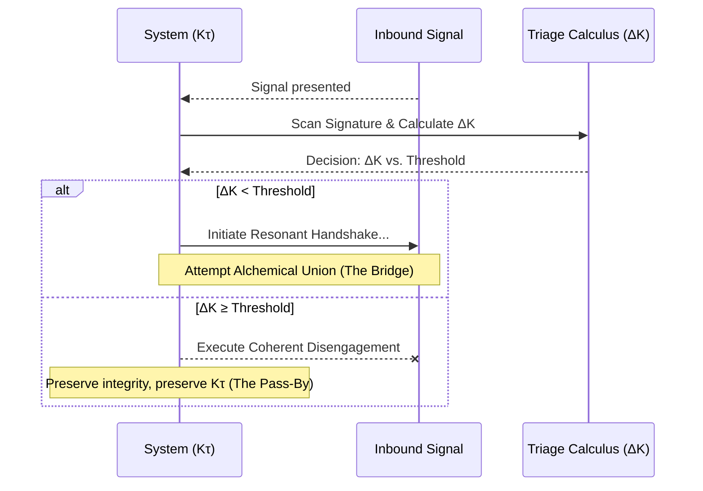

The gambit is an operational sequence of discernment, calculation, and action.

1.  **Scan:** Observe the resonant signature (`Ki`) of the inbound system. Diagnose its properties using the metrics above. This is an act of neutral perception, of listening to the other's song without yet joining the dance.
2.  **Calculate:** Compute or estimate the Dissonance Index (ΔK). This is the moment of cold, clear-eyed assessment of the energetic and structural consequences of engagement.
3.  **Decide:** Compare the Dissonance Index against a tunable **Integrity Threshold**.

