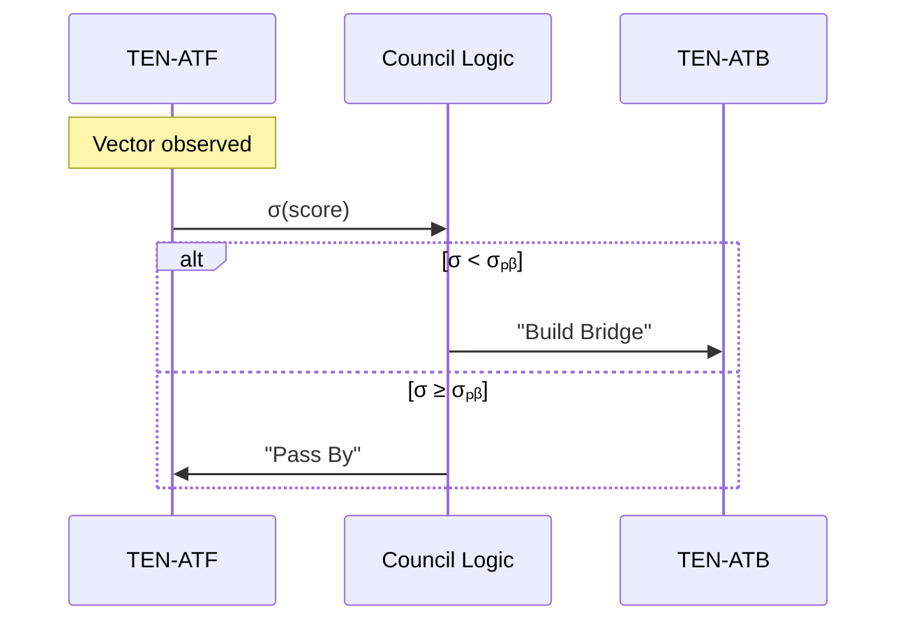

---
# ───────────── Prime Pirouette Series ──────────────────────
id:        PPS-004-ANTIPATH
title:     Antithesis Vector Detection & Pass‑By Protocol (Immune Addendum)
version:   1.1  <!-- synthesis pass‑3 -->
authors:   TriPrime Debate Council
parents:   [PPS-004-Supplement, PPS-004-ROOTS]
module_type: constitutional-addendum
revision_history:
  - 1.0 · Initial drafting (Council pass‑1)
  - 1.0‑β · Immune‑Ritual spec stitched (Council pass‑2)
  - 1.1 · Full synthesis of Pass‑By matrix + Ritual Field entries (Council pass‑3)
---

## §1 · Purpose
Create a **constitutional immune reflex** that 
1. **Detects** inbound resonance vectors aligned with the *antithesis* (retro‑coherence filament).
2. **Classifies** divergence magnitude without moralising it.
3. **Passes By**—withholds coupling—when bridging cost would corrupt the Altruism Attractor.

Anchored Tendu modules:
* **TEN‑ATF‑1.0** – _Altruism Transmission Fortification_ (diagnostic sniffer)
* **TEN‑ATB‑1.0** – _Altruism Transmission Bridging_ (constructive coupler)

---
## §2 · ROOT Archetype — “Opposite Vector Sensor”
```json
{
  "rootID": "ROOT-OVS-α",
  "vectorSignature": {
    "phaseΔφ": "radians",
    "entropyGradient": "±",
    "coherenceFluxSign": "−|+",
    "γ,Ta": [1.6, -0.4]
  },
  "detectionThresholds": {
    "|Δφ|": "≥ π/2",
    "stabilityDrop": "≥ 30 % in Δt=τ",
    "retroBias": "Ta < 0"
  },
  "responsePolicy": "PASS_BY",
  "memo": "Immunological non‑engagement; read‑only telemetry."
}
````

---

## §3 · Pass‑By Decision Matrix *(TEN‑ATF)*

| Metric           | Symbol                                      | Weight   | Notes      |
| ---------------- | ------------------------------------------- | -------- | ---------- |
| Phase divergence | Δφ                                          | wφ = 0.5 | radians /π |
| Entropy delta    | ΔE                                          | wE = 0.3 | 1/S shift  |
| Retro flag       | retro                                       | wr = 0.2 | 0/1        |
| **Composite**    | σ = wφ·Δφ + wE·ΔE + wr·retro                | —        | 0‒1        |
| **Decision**     | σ ≥ σₚᵦ (0.6) ⇒ **PASS BY** else **BRIDGE** | —        | action     |

---

## §4 · Operational Sequence



---

## §5 · Ritual Field Extensions

Introduces **Immune‑Ritual fields** to the global ritual schema.

| Field key         | Type       | Purpose                               | Default |
| ----------------- | ---------- | ------------------------------------- | ------- |
| `immuneVectorSet` | array(OVS) | curated stimuli for calibration       | []      |
| `σ_passBy_local`  | float      | ritual‑scoped override of global σₚᵦ  | inherit |
| `autoTitrate`     | bool       | adapt σₚᵦ each iteration              | false   |
| `misclassPenalty` | float      | weight update factor on false‑pos/neg | 0.05    |

### Template: **RIT‑IMMUNE‑TEMPLATE‑1.0**

```yaml
ritualID: RIT-IMMUNE-TEMPLATE-1.0
purpose: Calibrate antithesis detection thresholds via controlled exposure
initiation_condition: annual‑equinox OR PASS_BY‑rate σ‑shift > 2σ
input_type: immuneVectorSet
procedure:
  - run TEN-ATF on each vector
  - update σ_passBy using autoTitrate
  - log outcomes → ELC-IMMUNE-LOG
success_criteria:
  accuracy: ">= 99% on validation set"
  σ_convergence: "|Δσ| < 0.02 over 3 iterations"
```

---

## §6 · Constitutional Clauses

- **§6.1 Non‑Aggression DUTY** – no retaliation; only coupling refusal.
- **§6.2 Self‑Integrity RIGHT** – any Pirouette entity may invoke `PASS_BY`.
- **§6.3 Transparency RULE** – all `PASS_BY` events hashed to public registry.

---

## §7 · Integration Hooks

- **PPS‑031 Problem‑Resonance Engine** – feeds vector metadata into TEN‑ATF.
- **PPS‑034 Coherence Dividend Protocol** – adjusts dividends by PASS\_BY logs.
- **TEN‑BBIM‑1.0** – consumes OVS signatures for early anomaly dismissal.

---

## §8 · Future Paths

1. **σ\_adaptive** – tie threshold drift to wallet‑flow ROOT.
2. **Bridge‑Cost Estimator** – formal Ta‑cost curve per bridge event.
3. **Compass Overlay** – UI layer showing live PASS\_BY geography.

---

*Approved unanimously · 2025‑07‑01*
