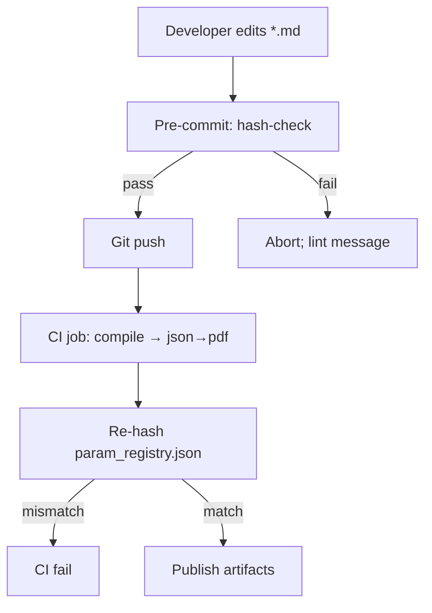

---  # ───────────── YAML front-matter ────────────────────────────────
id:        PPS-009
title:     Registry CI & Hash Mechanics
version:   0.2
parents:   [PPS-007]
children:  [All build pipelines, Ascendant vote scripts]
engrams:
  - synthesis:git-hook
  - concept:hash-immutability
  - directive:ci-enforcement
  - provenance:registry-ci-proposal
keywords:  [ci, hash, registry, sha256, devops, reproducibility]
uncertainty_tag: Medium
entropy_score: 0.05
module_type: core-protocol
quantisation_rule: registry_hash = SHA256(parameter_table)
---  # ───────────── Markdown body ────────────────────────────────────

## 1 · Purpose & Scope  
This module operationalises the **`registry_hash = SHA256(parameter_table)`**
rule from PPS-007.  It defines a minimal Git-based CI pipeline and pre-commit
hook so that *any* change to the parameter registry bumps the hash, fails a
build if undocumented, and logs the mutation for Ascendant review.

---

## 2 · Workflow Overview  


Pre-commit catches accidental symbol drift early.

CI rebuilds the registry and verifies the published hash used in Volume-5
header matches the rebuilt one.

## 3 · Pre-commit Hook (bash)
``` # .git/hooks/pre-commit
echo "▶ Pirouette param-registry hash check"
python scripts/hash_registry.py || {
  echo "✖ Registry hash mismatch — run 'python scripts/hash_registry.py --fix'"
  exit 1
}
```

``` # hash_registry.py:

import json, hashlib, sys, pathlib, re

REG_PATH = pathlib.Path("output/json/param_registry.json")
TABLE    = json.loads(REG_PATH.read_text())["parameters"]
h = hashlib.sha256(json.dumps(TABLE,sort_keys=True).encode()).hexdigest()

header_file = pathlib.Path("modules/PPS-007_parameter_registry_&_symbolic_grammar.md")
if h not in header_file.read_text():
    if "--fix" in sys.argv:
        text = header_file.read_text()
        new = re.sub(r'registry_hash\s*=\s*SHA256\([^)]+\)',
                     f'registry_hash = {h}', text)
        header_file.write_text(new)
        print("✔ Registry hash updated to", h)
    else:
        print("Expected hash not found:", h)
        sys.exit(1)
```

## 4 · CI Snippet (GitHub Actions)
```# .github/workflows/pirouette-build.yml
name: Pirouette Build
on: [push, pull_request]
jobs:
  compile:
    runs-on: ubuntu-latest
    steps:
      - uses: actions/checkout@v4
      - run: sudo apt-get install texlive-full pandoc
      - run: python compiler.py --json-only   # emits param_registry.json
        run: python scripts/hash_registry.py
```
## 5 · Governance hooks
Event	Trigger	Action
Registry row added	MR includes PPS-007 table edit	CI fails → reviewer must reference PPS-009 §3 fix or supply Ascendant motion.
Hash mismatch on main	Direct push bypassed hook	Block deploy; auto-open incident ticket.
Ascendant-approved schema change	Merge of PPS-007 v≥1.0 → v+1	CI bump allowed; new hash becomes canonical.

## 6 · Triaxial Resonance Lens
Art	Law	Philosophy
Hash = the seal on Pirouette’s wax tablet.	No build, no blessing without hash match.	Truth that can’t be reproduced isn’t truth.

## Assemblé · “The Ledger’s Seal”
Numbers wander; the seal keeps count.

## Librarian Note
Any pipeline integrating Pirouette modules must run
hash_registry.py after compilation to certify the artefacts.
Changing the hashing algorithm requires super-majority Ascendant vote
and concurrent PPS-007 update.