---  # ───────────── YAML front-matter ─────────────────────────────
id:        PPS-011
title:     Glossary & Quick-Reference Cards
version:   0.2-draft              # CV-patches applied
parents:   [PPS-007]
children:  [All onboarding docs, IDE plug-ins]
engrams:
  - synthesis:auto-extract
  - concept:cheat-sheet
  - concept:operational-cue
  - directive:human-onboarding
  - provenance:glossary-seed
keywords:  [glossary, cheat-sheet, docs, auto]
uncertainty_tag: Low
entropy_score: 0.04
module_type: core-doc
quantisation_rule: glossary_hash = SHA256(glossary_table)
---

## 1 · Purpose & Scope  
Generate three auto-maintained artefacts:

* **Glossary-Markdown** — grouped by theme, each term with an *Operational Cue*.  
* **Cheat-sheet PDF** — triaxial *Mandala* plus micro-definitions.  
* **IDE JSON** — tooltip text for editor plugins.

All content is pulled from **PPS-007**; updating the registry updates every doc.

---

## 2 · Auto-generation flow  

```mermaid
graph TD
  A[PPS-007 table] --> B[glossary_builder.py]
  B --> C[glossary.md]
  B --> D[cheatsheet.tex]
  D --> E[pdf → cheatsheet.pdf]
  B --> F[glossary.json]
```



---

## 3 · Build-script stub (`scripts/glossary_builder.py`)

```python
import json, pathlib, hashlib, subprocess, textwrap

TAB = json.load(open("output/json/param_registry.json"))["parameters"]

# --- thematic buckets (CV-2) ---
BUCKETS = {
    "Core Fields": {"T_Q","T_I","T_C","Γ","φ"},
    "Foundational Principles": {"𝓛","Resonance Optimisation","Covariance"},
    "Dynamic Structures": {"Entity","Wound-Channel","Radiance"},
    "Protocols": {"KRP","ICS"}
}
def bucket(sym):
    return next((k for k,v in BUCKETS.items() if sym in v), "Misc")

rows = [(bucket(p["symbol"]), p["symbol"], p["desc"], p.get("cue","—"))
        for p in TAB]

# --- Markdown glossary ---
sections = {}
for b,s,d,c in rows:
    sections.setdefault(b, []).append(
        f"- **{s}** — {d}" + (f"  _({c})_" if c!="—" else ""))
md = "\n".join(f"\n### {k}\n" + "\n".join(v) for k,v in sections.items())
pathlib.Path("output/docs/glossary.md").write_text(md)

# --- Cheat-sheet TeX (Mandala + tri-column) ---
mandala = r"""
\begin{center}
\begin{tikzpicture}[scale=0.9]
  \node[circle,draw,fill=gray!10,minimum size=2cm] (C) at (0,0) {$\mathcal{L}$};
  \foreach \ang/\name in {90/$T_a$,210/$\Gamma$,330/$\phi$}
    \node[circle,draw,fill=gray!5] at (\ang:3cm) {\name};
  \foreach \ang/\name in {60/Observe,120/Sharpen,180/Bind,240/Fork,300/Release}
    \node[rectangle,draw] at (\ang:5cm) {\name};
  \foreach \ang/\name in {45/Entity,135/Wound,225/Radiance,315/CV}
    \node[diamond,draw] at (\ang:7cm) {\name};
\end{tikzpicture}
\end{center}
"""
items = "\\\\\\".join(f"\\textbf{{{s}}}: {d}" for _,s,d,_ in rows)
tex = textwrap.dedent(f"""
\\documentclass{{article}}
\\usepackage{{multicol,tikz}}
\\begin{{document}}
{mandala}
\\begin{{multicols}}{{3}}
{items}
\\end{{multicols}}
\\end{{document}}
""")
pathlib.Path("output/tmp/cheatsheet.tex").write_text(tex)
subprocess.run(["pdflatex","-output-directory","output/tmp","cheatsheet.tex"])

# --- glossary_hash back-patch ---
hash_ = hashlib.sha256(md.encode()).hexdigest()
hdr   = pathlib.Path("modules/PPS-011_glossary_and_quick-ref.md")
txt   = hdr.read_text().replace(
        "glossary_hash = SHA256(glossary_table)", f"glossary_hash = {hash_}")
hdr.write_text(txt)
```

---

## 4 · Deliverables & CI hook  

| Artifact | Path | Trigger |
|----------|------|---------|
| `glossary.md`    | output/docs/  | registry edit |
| `cheatsheet.pdf` | output/docs/  | registry edit |
| `glossary.json`  | output/json/  | registry edit |

CI fails if header’s `glossary_hash` ≠ newly generated hash.

---

## 5 · Triaxial Resonance Lens  

| Art                                   | Law                               | Philosophy                              |
|---------------------------------------|-----------------------------------|-----------------------------------------|
| Glossary = **palette**                | Each term must resolve to source  | Language is the first field we perturb. |

---

## Assemblé · “Words as Way-stones” 
> *Step on the stone, cross the river.*

---

## Librarian Note  
This file is auto-generated. Manual edits will be overwritten; change terms in **PPS-007** instead.
