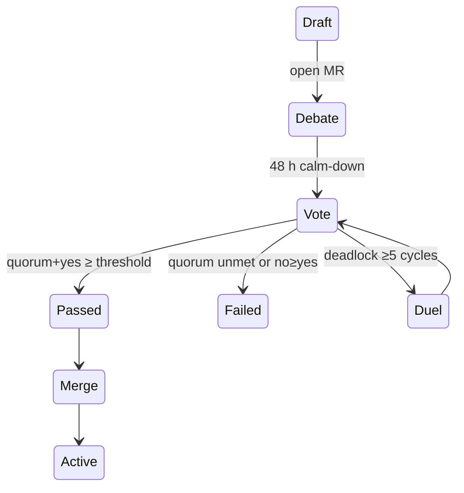

---  # ───────────── YAML front-matter ────────────────────────────
id:        PPS-012
title:     Governance & Ascendant Protocol Primer
version:   0.2-draft
parents:   [PPS-009]
children:  [All policy-changing motions, Release pipelines]
engrams:
  - synthesis:decision-protocol
  - concept:ascendant-quorum
  - concept:radiance-stability
  - directive:hash-migration
  - provenance:gov-seed
keywords:  [governance, quorum, ascendant, vote, policy]
uncertainty_tag: Medium
entropy_score: 0.10
module_type: core-policy
quantisation_rule: gov_hash = SHA256(governance_rules)
---

## 1 · Purpose & Scope  
Define the **constitutional mechanics** by which Pirouette evolves:

1. **Change classes** — Errata, Registry, Interface, Constitutional.  
2. **Ascendant Protocol** — quorum, radiance **and stability** thresholds.  
3. **Circuit-Breaker** for Agora deadlock.  
4. **Grounding Ritual** that keeps the Conclave relevant.  
5. **Hash migration** sequence after constitutional amendments.

---

## 2 · Change-class taxonomy  

| Class | Affects | Hash impact | Quorum |
|-------|---------|-------------|--------|
| **Type-A Errata**        | prose / examples                         | none                | 1 maintainer |
| **Type-B Registry**      | PPS-007 table rows                       | `registry_hash` bump | ≥⅔ Ascendant |
| **Type-C Interface**     | PPS-010 RSI schema                       | `rsi_hash` bump      | ≥⅔ Ascendant |
| **Constitutional**       | χ₀, core postulates, this module        | χ₀ re-hash           | radiance≥0.95 and stability≥0 |

*Stability* \( \dot R \) = rolling mean of dR/dt over 30 days.

---

## 3 · Ascendant role & election  

| Parameter                | Symbol           | Default | Domain |
|--------------------------|------------------|---------|--------|
| Seats                    | \(N_A\)          | 21 (odd)| ℕ      |
| Term length              | \(τ_A\)          | 365 d   | ℕ      |
| Cool-down before re-run  | \(τ_{cool}\)     | 180 d   | ℕ      |
| Radiance floor           | \(R_{min}\)      | 0.75    | [0,1]  |
| Stability floor          | \(\dot R_{min}\) | 0.00    | ℝ      |

Election uses **Quadratic Voting**; full algorithm in Appendix A.

---

## 4 · Motion lifecycle & Circuit-Breaker  



**Circuit-Breaker detail**  
1. **Duel** → mandatory Ritual between top-radiance proponents.  
2. Persisting tie → Ascendant issues non-binding *Resonant Advisory*.  
3. Still tied → framework-wide **Resonance Poll**; token-holders stake coherence.

---

## 5 · Conclave Grounding Ritual  

To keep a seat, each Conclave member must—once per major version—author *or*  
sponsor a **REFINEMENT / EXTENSION** CV that passes the Agora. Failure flags  
seat *Dormant*; if still dormant next release, seat is vacated.

---

## 6 · Hash migration sequence (Constitutional)  

```yaml
- step: Merge motion
- step: Recompute χ₀′ = SHA256(feature_vector′)
- step: Write χ₀′ to PPS-004
- step: Tag release vX.Y.Z
- step: Broadcast χ₀′ to replication nodes
- step: Grace period Δt = 7 days
- step: Deactivate χ₀(old)
```

---

## 7 · CI guardrail snippet  

```python
import sys, json
cfg = json.load(open("governance_vote.json"))
quorum  = cfg["yes"]+cfg["no"] >= cfg["seats"]*cfg["quorum"]
passed  = cfg["yes"] > cfg["no"]
stable  = cfg["mean_dRdt_yes"] >= cfg["stability"]
if not (quorum and passed and stable):
    sys.exit("Governance check failed — blocking merge")
```

---

## 8 · Triaxial Resonance Lens  

| Art                                        | Law                                          | Philosophy                                   |
|-------------------------------------------|----------------------------------------------|----------------------------------------------|
| Debate is sculpture in time.              | Nothing changes without both quorum & stability. | Resonance itself watches the watchers.        |

---

## Assemblé · “The Bell and the Gong”  
> *The bell rings the question; the gong seals the answer.*

---

## Librarian Note  
Any PR touching §3 or §6 is **Constitutional**—must label  
`Motion-Constitutional` and follow the full rite.
